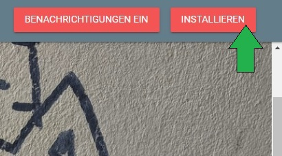

# Progressive Web Apps - Aktuelle Trends der IKT 2023

Graffiti hat nie einen gesammelten Platz, denn es erscheint zufällig auf unseren Straßen. Wer Lieblingsstraßenkünstler wie Banksy, Space Invader und co. hat, weiß auch, dass deren Kunstwerke gern wieder verschwinden. Deshalb ist es von so großer Bedeutung Bilder von der Straßenkunst zu machen.
In Berlin treibt seit einer Weile ein lustiges Einhorn sein Unwesen. Diese ursprünglich von Roydraws entworfene Zeichnung findet sich mittlerweile in so gut wie jeder Berliner Straße wieder.
Um deren Existenz zu dokumentieren, kam die Idee für das Graffiti-Archiv. Dies ist eine Progressive Web App, die für den Gebrauch auf mobilen Geräten und die Installation auf Diesen optimiert ist. So kann man die Street Art einfangen, sobald man sie sieht.

## Installation

#### 1. GitHub Repository Klonen
Der Quellcode dieses Programms liegt auf GitHub. Eine Installation erfolgt folgender Maßen.
Gehen Sie in den Ordner, in den Sie das Projekt speichern wollen.
Jetzt laden Sie sich mit folgenden Befehlen das Verzeichnis herunter und wechseln in den Projektordner.

```bash
git clone https://github.com/esedlak/Graffiti.git
cd Graffiti
```
#### 2. Node.js Installieren
Dieses Projekt läuft mit Node.js. Dieses muss auf Ihrem Rechner installiert werden. Sie sind in ihrem Terminal jetzt schon im Ordner Graffiti, jetzt geben Sie einfach den Befehl:

```bash
npm install
```
#### 3. MongoDB aufsetzen
Diese PWA speichert ihre Daten in Ihrer persönlichen Datenbank. Diese müssen Sie jetzt erstellen.
Unter https://www.mongodb.com/atlas/Datenbankkönnen Sie einen kostenlosen Cluster erstellen und Benutzer inklusive Passwort dafür erstellen. Bitte wählen Sie KEINE Zertifikatauthentifizierung sondern ausschließlich ein Passwort. Notieren Sie sich den Benutzernamen und das Passwort, welches Sie für die Datenbank festgelegt haben. Ihr Datenbankname ist auch wichtig zu notieren.

#### 4. .env Datei erstellen
Durch das Klonen des GitHub Repositories sind leider nicht alle benötigten Dateien in Ihren Ordner geladen worden, da das sicherheitstechnisch nicht geht. Sie müssen jetzt eine Datei namens .env im Backend Ordner erstellen. Dort hinterlegen Sie die von Ihnen in 3. festgelegten Informationen wie folgt:
```bash
DB_CONNECTION = mongodb+srv://<Benutzername>:<Passwort>@<Datenbankbezeichnung>.mongodb.net/
DB_NAME = <Datenbankname>
PORT = 3000
COLLECTION = 'posts'
```
Der Link für DB_CONNECTION ist der Verbindungslink für Ihre MongoDB. Dieser lässt sich auch in MongoDB Atlas unter Connect -> Driver -> Node.js ausgeben.
Den Datenbanknamen haben Sie selbst festgelegt. Er ist nicht der Clustername.

# Start
Jetzt öffnen Sie ein Terminal im Ordner Backend. Dort geben Sie einen npm-Befehl ein.

##### Was ist denn npm?
Im Ordner Backend ist innerhalb der Datei package.json ein kleines Skript eingebunden. Das sieht in diesem Fall so aus:
```json
"scripts": {
"backend": "node server.js"
},
```
#### 1. Backend starten
Wenn Sie ein Terminal im Backend Ordner gestartet haben geben Sie jetzt
```bash
npm backend
```
ein. Das Backend startet jetzt und im Terminal steht ungefähr:
```bash
PS C:\Users\User1\Documents\GitHub\Graffiti\backend> npm backend
store GridFsStorage {
  _events: [Object: null prototype] {},
  _eventsCount: 0,
  _maxListeners: 0,
  db: null,
  client: null,
  connected: false,
  connecting: true,
  caching: false,
  error: null,
  configuration: {
    url: 'mongodb+srv://<Benutzername>:<Passwort>@<Datenbankbezeichnung>.mongodb.net/',
    options: {
      useNewUrlParser: true,
      useUnifiedTopology: true,
      dbName: 'Graffiti'
    },
    file: [Function: file]
  },
  _file: [Function: file],
  _options: {
    useNewUrlParser: true,
    useUnifiedTopology: true,
    dbName: 'Graffiti'
  },
  [Symbol(kCapture)]: false
}
server running on http://localhost:3000
connected to DB
```
#### 2. Frontend starten
Öffnen Sie jetzt ein zweites Terminalfeld, welches im Hauptordner Graffiti startet.
Dort geben Sie wieder einen npm-Befehl ein, der ein Skript im package.json des Frontends ausführt:
```bash
npm start
```
Nun startet das Frontend und das Terminal sieht dabei ungefähr so aus:
```bash
PS C:\Users\User1\Documents\GitHub\Graffiti> npm start

> EDS_GFT_001@1.0.0 start
> http-server -c-1

Starting up http-server, serving ./public

http-server version: 14.1.0

http-server settings:
CORS: disabled
Cache: -1 seconds
Connection Timeout: 120 seconds
Directory Listings: visible
AutoIndex: visible
Serve GZIP Files: false
Serve Brotli Files: false
Default File Extension: none

Available on:
  http://192.168.56.1:8080
  http://192.168.178.26:8080
  http://127.0.0.1:8080
```
Wenn Sie auf 
```bash
  http://127.0.0.1:8080
```
klicken, gelangen Sie zur Oberfläche der PWA.

#### 3. (Optional) ngrok für eine sichere Verbindung
Wenn Sie Ihre PWA auch von außerhalb Ihres Gerätes erreichen wollen, müssen Sie einen sicheren Tunnel über ngrok erstellen.
Gehen Sie dafür auf https://ngrok.com/download und folgen den Anweisungen für Ihr Betriebssystem. 
Nutzen Sie Windows, laden Sie sich eine .exe Datei herunter. Diese öffnen Sie und fügen im Terminal Ihren Authtoken hinzu, welchen Sie vorher erstellt haben. Sobald Sie diesen hinzugefügt haben, müssen Sie im Terminal nur noch 
```bash
  ngrok http 8080
```
eingeben. Dann gibt ngrok einen Link aus, welcher diesem ähnelt:
```bash
  https://ca5f-2a0a-2782-3f3-a545-41cd-9a71-ec8-2b5f.ngrok-free.app -> http://localhost:8080
```
Diesen Link kopieren Sie und geben ihn in die Browserleiste ein. 

# Verwendung
Sie werden auf eine Website geleitet, welche mobil ungefähr so aussieht. 
Wenn Sie den Bildschirm erweitern sehen Sie die Installationsfunktion:

Wenn Sie den Bildschirm erweitern sehen Sie die Installationsfunktion:

Drücken Sie auf diesen Button, dann installiert sich die Anwendung auf Ihrem Rechner.
Um Push-Benachrichtigungen zu erhalten, klicken Sie auf den Button "Benachrichtigungen ein". Ihr Browser fragt jetzt, ob Sie diese Nachrichten zulassen wollen. Wenn Sie das Pop-Up bestätigen erschein eine Push-Nachricht auf Ihrem Bildschirm.


Wenn Sie auf den Plus Button unten rechts klicken, können Sie neue Bilder erstellen.


Ihre Kamera wird geöffnet. Sobald Sie mit dem Bild zufrieden sind, klicken Sie darunter auf den Foto Button.
Geben Sie Ihrem Foto einen Titel und einen Ort. Diesen können Sie entweder manuell oder über den Location Button hinzufügen.


###  Weiterführende Links
- Node.js: [Installationsanleitung](https://nodejs.org/)
- MongoDB: [Installationsanleitung](https://docs.mongodb.com/manual/installation/)
- MongoDB Cloud: [Website](https://cloud.mongodb.com/)